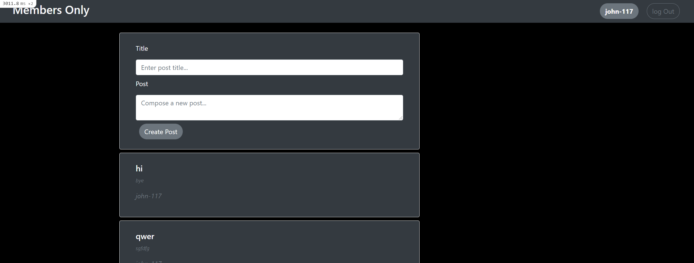

# Members-Only

> Simple page to create posts, but you need to sign in to know who is the author of each post.

In this project, you’ll be building an exclusive clubhouse where your members can write anonymous posts. Inside the clubhouse, members can see who the author of a post is but, outside, they can only see the story and wonder who wrote it.

## Built With

- Ruby
- Ruby on Rails
- SQLite3

To get a local copy up and running follow these simple example steps.

### Prerequisites

- Ruby
- Ruby on Rails
- SQLite3
- yarn
- Node.js

### Setup

- Clone the project with `git clone https://github.com/sjcco/members-only`

### Usage

- Start the server in a new terminal by navigating to the project folder and using `bin/rails server`
- Visit [this page](http://localhost:3000/) to see the posts witout the name of the autor.
- To sign in you first need to register by clicking the sign up button in top right corner and filling the form.
- Now that you are signed in you'll be able to see the author and the form to create your own posts.

## Authors

👤 **Juan Carlos Campos**

- GitHub: [@sjcco](https://github.com/sjcco)
- Twitter: [@CarlosCamposO](https://twitter.com/CarlosCamposO)

## 🤝 Contributing

Contributions, issues, and feature requests are welcome!

Feel free to check the [issues page](https://github.com/sjcco/members-only/issues/).

## Show your support

Give a ⭐️ if you like this project!

## Acknowledgments

- Microverse team
- The Odin Project

## 📝 License

This project is [MIT](lic.url) licensed.
